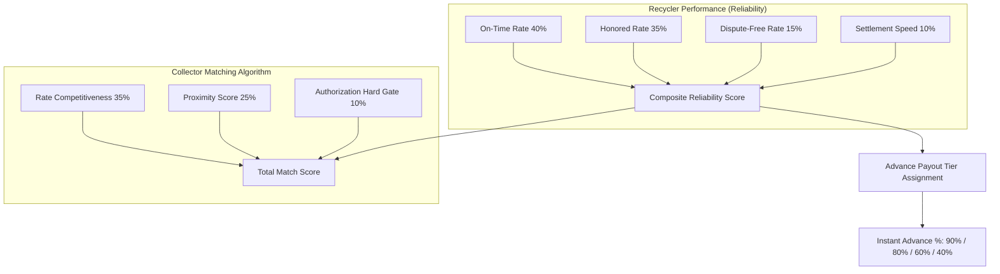

# ♻️ ScrapLink — Authorized E-Waste Recycler & Facility Operations Hub
### Smart India Hackathon (SIH 2026) | Problem Statement: PS-26229 | Team ScrapLink

[](https://react.dev/)
[](https://www.typescriptlang.org/)
[](https://vitejs.dev/)
[](https://tailwindcss.com/)
[](https://cpcb.nic.in/)
[](#-vernacular-accessibility--offline-readiness)

---

## 📌 Executive Summary

India produces over **3.2 million tonnes of e-waste annually**, with more than **90% processed through the unorganized/informal sector**. Informal waste pickers and scrap collectors face opaque pricing, exploitative middlemen, delayed settlements, and hazardous crude extraction techniques, while CPCB-registered formal recyclers struggle with predictable supply pipelines and verified provenance.

**ScrapLink** bridges this gap through a unified dual-sided ecosystem. This repository contains the **Authorized Recycler & Facility Operations Console** — a high-performance, real-time command dashboard engineered to:
- Establish transparent benchmark-driven pricing across 19+ e-waste sub-categories.
- Provide instant, tier-governed advance liquidity to informal collectors upon verifiable lot handover.
- Automate weight discrepancy & rate anomaly detection with real-time audit triggers.
- Quantify recycler trust via a transparent 4-factor Composite Reliability Score.
- Issue tamper-proof, QR-verifiable digital Green Handover Certificates complying with CPCB E-Waste Management Rules.

---

## 🌟 Core Modules & Capabilities

```
┌────────────────────────────────────────────────────────────────────────────────────────┐
│                                SCRAPLINK RECYCLER CONSOLE                              │
├──────────────────────────┬────────────────────────────┬────────────────────────────────┤
│ 📊 MARKET & PRICING      │ 📦 INTAKE & LOGISTICS      │ 🛡️ TRUST & COMPLIANCE         │
│ • Rates Benchmark Engine │ • Inward Lot Weighbridge   │ • Composite Reliability Index  │
│ • 30-Day Trend Analytics │ • Service Catchment Radius │ • Anomaly & Fraud Review Hub   │
│ • Category Demand Plan   │ • Instant Advance Payments │ • CPCB Green QR Certificates   │
└──────────────────────────┴────────────────────────────┴────────────────────────────────┘
```

### 1. 📈 Rates Benchmark & Pricing Engine (`RatesBenchmarkView`)
- Real-time comparison between facility offered rates, fair benchmark prices, and 30-day trailing averages.
- Built-in dynamic **Rate Score Calculation** ($Score = \min(1, \frac{Rate_{offered}}{Rate_{fair}})$) which directly impacts facility ranking on the collector side.
- Instant per-category price adjustments with live recalculation of matching competitiveness.

### 2. 📊 Price Trend Intelligence (`PriceTrendsView`)
- 30-day historical price movement tracking across high-value metals (copper, aluminum), circuit boards (high-grade/low-grade PCBs), lithium/lead-acid batteries, and plastics.
- Identifies macro scrap market trends to inform purchasing strategies and seasonal demand buffering.

### 3. 🎯 Demand Outlook & Intake Forecasting (`DemandOutlookView`)
- Category-level target demand vs. actual intake tracking against daily facility capacities (500 kg/day).
- Real-time intake utilization bars highlighting under-supplied materials to adjust purchasing incentives.

### 4. ⚖️ Digital Weighbridge & Inward Lot Processing (`IncomingLotsView`)
- Complete intake workflow: barcode/lot search, quoted vs. physical weighbridge verification.
- **Automated Deviation Safeguard**: Variations $>10\%$ between quoted and physical weight immediately trigger visual discrepancy alerts and route the lot to the Anomaly Review queue.

### 5. 💸 Instant Advance Liquidity & Payment Ledger (`HandoverPaymentsView`)
- Solves the informal sector's liquidity bottleneck by paying collectors immediately upon digital weigh-in.
- **Dynamic Tier-Based Advance Rate**:
  - **Tier A Recycler ($\ge 0.90$)**: $90\%$ instant advance.
  - **Tier B+ Recycler ($\ge 0.80$)**: $80\%$ instant advance.
  - **Tier B Recycler ($\ge 0.65$)**: $60\%$ instant advance.
  - **Tier C Recycler ($< 0.65$)**: $40\%$ instant advance.
  - *Lots under anomaly review are held at 0% until inspected.*
- One-click simulated UPI/bank disbursement with real-time settlement ledger tracking.

### 6. 🚨 Anomaly Review & Discrepancy Auditing (`AnomalyReviewView`)
- Rule-based algorithmic fraud detection flagging price quotes deviating $>30\%$ from regional median rates.
- Operator review interface with clear context (cold-start rates, grade discounts, damaged lots) and one-click override / re-benchmarking actions.

### 7. 🏆 Recycler Composite Reliability Index (`ReliabilityView`)
- Fully transparent, auditable score out of 100 powering both matching rank and advance payout limits.
- Evaluates on-time pickups, honoring quoted prices, low dispute frequency, and rapid balance settlements.

### 8. 🗺️ Logistics & Catchment Radius Optimization (`ServiceAreaView`)
- Interactive service radius control (5 km to 50+ km) with zone-wise transit time estimations.
- Real-time breakdown of inward lot density and transit lag across micro-zones.

### 9. 📜 CPCB-Compliant Digital Certificates (`CertificatesView`)
- Generation of tamper-proof Green Recycling Handover Certificates with cryptographic IDs and QR verification.
- Calculates verifiable environmental impact offsets:
  - $\text{CO}_2$ emissions avoided (kg)
  - Landfill diversion volume (kg)
  - Toxic heavy metal containment (lead, mercury, cadmium)

### 10. 🔄 Reverse Match & Ranking Simulator (`MatchRankingView`)
- Live interactive twin demonstrating exactly how collector mobile apps perceive and rank this facility against competing recyclers based on rate, distance, reliability, and authorization status.

---

## 📐 Mathematical Models & Scoring Formulas

Every metric, percentage, and ranking score in ScrapLink is grounded in deterministic formulas:



### 1. Composite Reliability Score ($R$)
$$R = 0.40 \cdot S_{\text{on-time}} + 0.35 \cdot S_{\text{honored}} + 0.15 \cdot (1 - S_{\text{dispute}}) + 0.10 \cdot S_{\text{settlement}}$$

Where:
- $S_{\text{settlement}} = \max\left(0, 1 - \frac{\text{avg\_settlement\_hours}}{48}\right)$

### 2. Collector-Recycler Match Score ($M$)
$$M = 0.35 \cdot S_{\text{rate}} + 0.30 \cdot R + 0.25 \cdot S_{\text{proximity}} + 0.10 \cdot S_{\text{auth}}$$

Where:
- $S_{\text{rate}} = \min\left(1, \frac{\text{Offered Rate}}{\text{Fair Benchmark Rate}}\right)$
- $S_{\text{proximity}} = \max\left(0, 1 - \frac{\text{Distance (km)}}{\text{Service Radius (km)}}\right)$
- $S_{\text{auth}} = 1.0 \text{ if CPCB Registered \& Category Accepted, else } 0.0 \text{ (Hard Exclusion Gate)}$

### 3. Automated Anomaly Detection
$$\Delta_{\text{price}} = \frac{|\text{Offered Rate} - \text{Category Median}|}{\text{Category Median}} \times 100 \quad (\text{Flagged if } \Delta_{\text{price}} > 30\%)$$
$$\Delta_{\text{weight}} = \frac{|\text{Received Weight} - \text{Quoted Weight}|}{\text{Quoted Weight}} \times 100 \quad (\text{Flagged if } \Delta_{\text{weight}} > 10\%)$$

---

## 🌐 Vernacular Accessibility & Offline Readiness

To ensure seamless adoption across diverse grassroots collectors and industrial yard operators in India:

- **6 Supported Indian Languages**:
  - 🇬🇧 English (`en`)
  - 🇮🇳 Hindi / हिन्दी (`hi`)
  - 🇮🇳 Marathi / मराठी (`mr`)
  - 🇮🇳 Bengali / বাংলা (`bn`)
  - 🇮🇳 Odia / ଓଡ଼ିଆ (`or`)
  - 🇮🇳 Tamil / தமிழ் (`ta`)
- **Offline Mode & Sync Simulator**: In-transit scrap weighing records can be staged offline in local storage and synced automatically with one click once connectivity is restored.

---

## 🛠️ Technology Stack

| Layer | Technology | Purpose |
| :--- | :--- | :--- |
| **Frontend Framework** | [React 19.2](https://react.dev/) | Component architecture & declarative state rendering |
| **Language** | [TypeScript 6.0](https://www.typescriptlang.org/) | Type-safe domain models & contract validation |
| **Build & Dev Tool** | [Vite 8.3](https://vitejs.dev/) | Ultra-fast HMR and optimized asset bundling |
| **Styling** | [Tailwind CSS v4](https://tailwindcss.com/) | Modern design system, accessible UI & responsive layouts |
| **Icons & UI FX** | [Lucide React](https://lucide.dev/) + Canvas Confetti | Visual glyphs and micro-interaction rewards |
| **State Management** | React Context + Custom Hooks | Centralized reactive dashboard state & offline storage |
| **Linter** | [Oxlint](https://oxc.rs/) | High-speed Rust-powered JavaScript/TypeScript linting |

---

## 📁 Repository Structure

```
SIH Dashboard/
├── index.html                  # HTML entry point with metadata & fonts
├── package.json                # Project dependencies & scripts
├── tsconfig.json               # Root TypeScript configuration
├── vite.config.ts              # Vite + Tailwind + React configuration
└── src/
    ├── main.tsx                # Application root mounting
    ├── App.tsx                 # Core layout shell, navigation & toast provider
    ├── index.css               # Global Tailwind CSS and animation tokens
    ├── types/
    │   └── dashboard.ts        # Domain models (Lots, Materials, Metrics, Profiles)
    ├── context/
    │   └── DashboardContext.tsx # Central state, formulas, filters, & persistence
    ├── data/
    │   └── mockData.ts         # Initialized CPCB facility dataset (Kharagpur Metal Recovery)
    ├── i18n/
    │   └── translations.ts     # Multi-lingual dictionary (en, hi, mr, bn, or, ta)
    └── components/
        ├── layout/
        │   ├── Header.tsx      # Top bar with CPCB badge, offline toggle & language select
        │   └── Sidebar.tsx     # 11-module navigation panel with live badges & tier pill
        ├── modals/
        │   ├── CertificateModal.tsx      # Printable CPCB Green Certificate preview
        │   ├── FormulaExplainerModal.tsx # Judge Criteria & mathematical formula inspector
        │   └── HandoverModal.tsx         # Inward lot weighbridge & payment confirmation
        └── views/
            ├── OverviewView.tsx          # Real-time KPI summary & activity stream
            ├── RatesBenchmarkView.tsx    # Category rate benchmark manager
            ├── PriceTrendsView.tsx       # 30-day market price trend charts
            ├── DemandOutlookView.tsx     # Demand forecast vs. intake capacity
            ├── IncomingLotsView.tsx      # Inward lot intake & weight discrepancy checker
            ├── HandoverPaymentsView.tsx  # Tiered advance liquidity & settlement ledger
            ├── AnomalyReviewView.tsx     # Anomaly resolution & audit interface
            ├── ReliabilityView.tsx       # 4-pillar Composite Reliability Scorecard
            ├── ServiceAreaView.tsx       # Logistical service radius & zone density
            ├── CertificatesView.tsx      # Green recycling certificate repository
            └── MatchRankingView.tsx      # Reverse match ranking simulator
```

---

## 🚀 Getting Started

### Prerequisites
- **Node.js**: `v18.0.0` or higher (Node.js 20+ recommended)
- **npm**: `v9.0.0` or higher (or `pnpm` / `yarn`)

### Installation & Local Setup

1. **Clone the repository:**
   ```bash
   git clone https://github.com/aryanpal2006/SIH-Prototype-2026-PS-26229-Team-ScrapLink-.git
   cd "SIH Dashboard"
   ```

2. **Install dependencies:**
   ```bash
   npm install
   ```

3. **Start the local development server:**
   ```bash
   npm run dev
   ```
   Open [http://localhost:5173](http://localhost:5173) in your browser.

4. **Lint and Type Check:**
   ```bash
   npm run lint
   ```

5. **Build for Production:**
   ```bash
   npm run build
   ```
   The production-ready bundle will be output to the `dist/` folder.

---

## 🏆 Smart India Hackathon (SIH 2026) Information

- **Problem Statement ID**: PS-26229
- **Title**: Formalizing the Informal E-Waste Supply Chain with Verifiable Traceability, Fair Pricing, and Instant Settlement
- **Team**: ScrapLink
- **Target Beneficiaries**: 
  1. Informal scrap pickers, collectors, and aggregates (Kabadiwalas)
  2. Registered authorized recyclers and PROs (Producer Responsibility Organizations)
  3. CPCB & State Pollution Control Boards (Compliance & EPR tracking)

---

## 📄 License

This project is developed for the **Smart India Hackathon 2026** competition. Distributed under the [MIT License](LICENSE).
